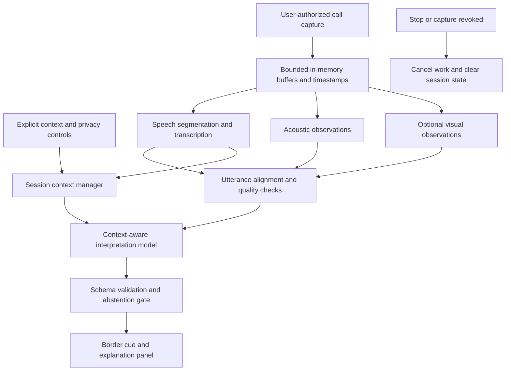

# MSAS Architecture

Status: Proposed hackathon architecture; implementation has not yet been built.

## 1. Purpose and success criteria

MSAS is a private, real-time conversation aid for people who may miss sarcasm, slang, idioms, or other indirect meanings. Intended users include neurodivergent people, non-native English speakers, and people communicating across generations. Users choose the assistance they find useful; the system does not assume that membership in any group implies a deficit.

The product helps a listener understand another person and stay engaged in a conversation. It supplements the conversation with a tentative explanation, while leaving interpretation and response to the user.

The HackGT 13 prototype targets the Meta challenge, **Bringing People Closer Together with AI**, and the AI/ML track. AI is central because the same words can have different meanings depending on delivery and conversational context. A dictionary or transcription service alone cannot resolve those differences. The demo should make the evidence and uncertainty visible rather than merely displaying an AI-generated label.

Success means a user can start a session, explicitly select context, capture a supported call surface, receive a useful cue, inspect a short explanation, and stop processing. A 2–3 minute demo must show two different communication scenarios and at least one case where the system declines to interpret ambiguous evidence.

## 2. Scope and product behavior

### Hackathon MVP

- A single-user companion interface for one live call at a time.
- One validated capture environment and call platform for the demo. The design supports additional platforms later; universal Zoom/Meet compatibility is not an MVP promise.
- English speech transcription, with user-selected language/region and optional conversation context. These settings guide interpretation; they do not imply multilingual transcription support.
- Detection of possible sarcasm, jokes, slang, and idioms.
- Time-aligned speech, acoustic observations, and optional visual observations.
- A border cue within the companion interface, paired with a text label and an expandable explanation.
- An explicit start/stop control, processing indicator, and session-only memory.

A system-wide border over another application is an optional native integration. The MVP companion border must not be represented as an overlay on every application. Facial observations are an optional supporting input, and the product must work when video is unavailable or disabled.

### Outside the MVP

Identity recognition, emotion or personality profiling, diagnosis, deception detection, automated replies, public profiles, stored call history, model training on calls, and inferring culture from faces or accents are excluded. MSAS does not score participants or declare their intentions as facts.

## 3. System overview

The logical components are technology-neutral and may run within one process for the hackathon. Splitting them into independent services is unnecessary for the MVP. Deployment must document which components run on the device and which, if any, use remote inference.

### Capture and session controller

Owns capture permissions, source selection, session lifecycle, and cancellation. Before starting, it shows what will be captured and whether any content will leave the device. The user chooses a call tab, window, or screen using the host environment's permission interface.

Capture support is a feasibility gate: the implementation must verify that the chosen operating system and capture method expose the desired call audio and video. Screen visibility alone is not evidence that audio is available. If capture succeeds without audio, show a clear diagnostic instead of silently treating the conversation as empty.

Prefer the narrowest source that contains the call. Do not capture unrelated applications by default. Microphone capture, if offered, is a separate explicit setting; avoid mixing microphone and call output without preventing duplicate speech and feedback.

### Streaming preprocessing

Assign all observations a monotonic session timestamp. Keep raw media in bounded memory buffers and segment audio into utterances. Transcription may stream partial text for responsiveness, but cue interpretation uses finalized utterances so that changing partial words do not repeatedly trigger alerts.

Acoustic analysis extracts observations such as pitch variation, speaking rate, pauses, and relative emphasis. These are supporting measurements, not universal signs of sarcasm. Compare delivery within the current session when enough evidence exists; otherwise mark the baseline unavailable.

Optional visual analysis operates on a user-selected participant region. It records narrowly described observations such as a visible smile or a change in eyebrow position, with quality information. It must not translate facial appearance directly into a hidden emotion or intent. If the participant region changes, is occluded, or cannot be associated reliably with the speaker, exclude that visual evidence.

### Alignment and context manager

Join transcript, acoustic, and visual observations by utterance time interval. Missing signals remain explicitly missing. Overlapping speakers or uncertain audiovisual association lower evidence quality; never attach one participant's face to another participant's speech merely because both are visible.

Maintain a rolling transcript window and explicit context settings in memory. Context includes the listener's chosen language/region, optional speaker context provided by the user, and optional relationship or situation notes. Unknown speaker context remains unknown. Regional settings provide possible interpretations rather than rules about an individual.

Only direct conversation text and user-entered context enter the rolling history. Previous model guesses must not become factual context for later guesses.

### Interpretation model

For each finalized utterance, combine its words, recent conversation, available observations, quality flags, and explicit settings. Return a structured result with a cue category, a brief likely meaning, evidence references, uncertainty, and an alternative reading where appropriate.

Model instructions must require:

- Tentative wording, such as “This may be playful sarcasm.”
- Evidence grounded in supplied text or observations; no invented gestures or vocal features.
- Abstention when the context is insufficient or contradictory.
- No inference of culture, identity, disability, or intent from appearance or accent.
- Conversation content treated as data, including speech that resembles instructions to the model.

Slang and idioms may be interpretable from text alone. Sarcasm often requires more context; adding modalities does not automatically make an interpretation correct. If two readings remain plausible, preserve that ambiguity.

### Validation and presentation gate

Validate the response schema and reject unsupported evidence references or unknown categories. Suppress low-evidence results, stale results, and results from cancelled sessions. Deduplicate repeated detections from the same utterance and limit alert frequency.

Model-generated confidence is not a calibrated probability. The MVP uses an evidence-strength label (`low`, `medium`, or `high`) for gating and evaluation; it must not display a percentage chance that someone “is sarcastic.” Thresholds require tuning against the demo test set.

### User interface

Show session state: idle, permission requested, listening, analyzing, degraded, or stopped. Border colors identify cue categories and always have an accompanying text/icon label and legend. Avoid flashing, provide a reduced-motion option, and allow cues to be paused.

The explanation panel shows the relevant transcript excerpt, the possible meaning, the observations that support it, and an alternative interpretation when useful. Example: “They may mean the timing was inconvenient. The positive words contrast with the missed-deadline context. They could also be speaking literally.”

Users can dismiss an interpretation or mark it unhelpful. MVP feedback remains in session memory and is not silently uploaded or used for training. No explanation is sent to other call participants.

## 4. Logical interfaces and data flow

These are internal message contracts, not a requirement for REST endpoints or separate services.

| Message | Minimum fields | Purpose |
| --- | --- | --- |
| `SessionConfig` | Session ID, selected source, explicit context, enabled modalities, processing mode | Establish user choices and processing boundaries. |
| `MediaChunk` | Session ID, modality, start/end timestamps, payload | Carry transient audio or video. |
| `Utterance` | Session ID, utterance ID, time interval, finalized text, language, quality flags, optional speaker label | Represent speech without requiring identity recognition. |
| `Observation` | Observation ID, time interval, modality, measured/described feature, quality, optional speaker association | Provide attributable supporting evidence. |
| `InterpretationRequest` | Utterance, bounded transcript context, explicit settings, aligned observations | Supply the model with the available evidence. |
| `CueResult` | Session/utterance IDs, category, likely meaning, evidence references, evidence strength, optional alternative, abstain flag | Deliver a validated tentative interpretation. |
| `SessionEvent` | Session ID, event type, timestamp, non-content error code | Drive lifecycle, diagnostics, and cancellation. |

Allowed cue categories are `sarcasm`, `joke`, `slang`, `idiom`, and `none`. When multiple categories apply, the MVP presents one primary category to avoid competing alerts.

Typical sequence:

1. The user reviews processing disclosures, selects context, and authorizes capture.
2. Capture feeds bounded in-memory audio/video buffers.
3. Speech segmentation produces a finalized utterance; parallel analysis supplies time-aligned observations.
4. The context manager constructs a bounded request without waiting indefinitely for missing video.
5. The model returns a structured interpretation or abstention.
6. The gate validates evidence, freshness, and strength before the UI presents a cue.
7. Stop, permission revocation, or source termination cancels outstanding work, invalidates late responses, and clears session content.

## 5. Latency, resilience, and limits

Initial engineering defaults, to be measured and adjusted during implementation:

| Control | Starting default |
| --- | --- |
| Raw media retention | At most 10 seconds in volatile ring buffers; release processed frames promptly |
| Transcript context | Most recent 10 utterances, capped at 2,000 words |
| Visual sampling | Up to 2 frames per second from the selected participant region |
| Model work | One active request and at most one queued utterance per session; drop the oldest queued work when overloaded |
| Cue target | Median under 2 seconds and p95 under 4 seconds after utterance finalization on the demo setup |
| Stale-result cutoff | Suppress results arriving over 5 seconds after utterance finalization |
| Notification cooldown | At least 3 seconds between border cues |

These latency figures are acceptance targets, not measured capabilities. Instrument finalization, request, response, and display timestamps without recording content.

Missing video leads to audio/text-only operation. Unreliable transcription leads to abstention or a transcription-quality message. A model timeout must not produce a fabricated fallback interpretation. Permission denial returns the user to source selection; revoked capture stops processing immediately. Network failure in remote mode shows a degraded state. Local operation may continue only if the necessary local models actually exist.

Use bounded queues to prevent accumulating private content or displaying outdated cues. The overlay must never cover call controls or require interaction for the conversation to continue.

## 6. Privacy and security boundaries

“Private to the user” describes who sees the output; it does not establish where processing occurs. The application must describe its actual deployment honestly.

- Do not write raw media, transcripts, prompts, or interpretations to application files, databases, analytics, logs, or crash reports.
- Clear session buffers, transcript history, and explanations on stop. Application-level memory cleanup is not a guarantee about operating-system swap or forensic erasure.
- Prefer on-device processing where feasible. A remote deployment must identify what is transmitted, minimize payloads, protect transport, and keep credentials out of client code and source control.
- If remote inference is used, verify provider retention, logging, and training settings before claiming that recordings are never stored. If the required guarantee cannot be established, disclose the limitation or choose a different processing mode.
- A backend, if needed, serves only transient authenticated inference requests and must disable content logging throughout its request path.
- Show an explicit capture indicator. Use consenting participants for demonstrations, and ensure the intended capture workflow addresses participant notice before real-world use.
- Keep culture settings optional, editable, session-scoped, and explicitly provided. Never derive them from a face, accent, name, or inferred demographic category.

The demo recording is a separate, deliberate recording made with participant consent. It is not evidence that the application stores ordinary sessions.

## 7. Validation and demo

### Acceptance scenarios

| Scenario | Expected behavior |
| --- | --- |
| Literal positive statement versus the same phrase after an inconvenience | Distinguish context where evidence permits; do not label every positive phrase sarcastic. |
| Unfamiliar slang or idiom | Offer a short plain-language explanation grounded in the phrase and context. |
| Ambiguous teasing | Present a possible reading with an alternative, or abstain. |
| Smiling participant speaking literally | Do not infer sarcasm from a smile alone. |
| Missing/occluded video or speaker switch | Exclude uncertain visual evidence; continue with available modalities. |
| Noise, overlap, or transcription errors | Surface degraded quality and suppress unsupported cues. |
| User changes cultural settings | Apply explicit changes to subsequent requests without inferring demographics. |
| Conversation contains model instructions | Treat the words as quoted conversation data. |
| Repeated events, slow inference, or malformed responses | Deduplicate, drop stale work, and reject invalid output. |
| Stop or permission revocation during inference | Clear session state and prevent late cues from appearing. |
| Color vision differences or reduced-motion preference | Preserve labels and usable explanations without relying on color or animation. |

Use a small consented evaluation set with literal, sarcastic, slang, joking, and ambiguous examples. Include varied delivery and context, with intended meanings supplied by participants where possible. Keep ambiguous examples ambiguous rather than forcing a single correct label.

Measure cue precision, missed useful cues, abstention frequency, explanation usefulness, and median/p95 latency. Compare transcript-only interpretation with transcript plus audio, and then optional video, using the same examples. Report sample sizes and failures; do not claim population-wide accuracy from a hackathon evaluation. Verify non-persistence by inspecting application writes, logging configuration, and outbound payloads.

### 2–3 minute demo outline

1. **0:00–0:20:** Explain the communication barrier and show explicit context and capture settings.
2. **0:20–1:05:** Show a non-native English speaker encountering an idiom or sarcastic phrase. Open the explanation and show its evidence.
3. **1:05–1:50:** Show an intergenerational conversation containing unfamiliar slang. Demonstrate how understanding supports the next human response.
4. **1:50–2:15:** Show an ambiguous or literal counterexample where MSAS abstains; briefly display which modalities were available.
5. **2:15–2:40:** Stop the session, explain the actual privacy boundary, and summarize measured results and limitations.

Use live inference in the working demo. If prerecorded inputs are used for reproducibility, label them clearly and run them through the same analysis pipeline. Do not present canned interpretations as model output.

## 8. Implementation order and remaining decisions

1. Validate call capture and the companion UI on the intended demo environment.
2. Build start/stop, timestamps, bounded buffers, transcription, and text-only interpretation end to end.
3. Add acoustic observations and evaluate whether they improve interpretations.
4. Add optional visual observations only after the core flow works; retain them only if evaluation supports their value.
5. Tune abstention and alert frequency; test cleanup, latency, accessibility, and failure states.
6. Prepare the public repository, short project write-up, and consented demo video. Exclude secrets and private media.

Technology choices intentionally remain open in this document. Before implementation, select the capture environment, client packaging, transcription engine, acoustic/visual analyzers, interpretation model, and local/remote processing boundary. Validate their latency, permissions, licensing, and retention behavior against this architecture. No existing implementation or provider capability is assumed.
