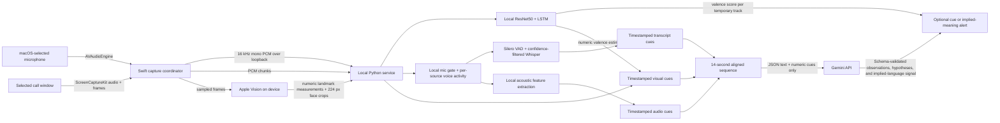

# Subtext application map

Subtext is a macOS floating communication aid for personal conversations. It aims to help people notice and clarify possible moments of misunderstanding while keeping the people, not the AI, at the center of the relationship.

## Data flow



Raw audio and video are processed locally. Gemini receives transcript text and compact numeric measurements, including the local face model's signed valence estimate, only when `GEMINI_API_KEY` is configured. The service does not persist conversation data to disk.

## macOS application

`macos/SubtextOverlay/Sources/SubtextOverlayApp.swift` contains the app shell, overlay, service client, ScreenCaptureKit coordinator, and local visual feature extraction.

- The overlay lets the user select a call window, refresh the window list, start or stop capture, mute local microphone transcription, and clear the current session. Starting capture transcribes the local microphone and selected call window; the microphone control can mute the local source at any time.
- The macOS-selected microphone is transcribed as speaker `self`; selected-window audio is transcribed as speaker `other`. Muting the local microphone gate does not stop call-window capture or remote-speaker transcription.
- ScreenCaptureKit captures selected-window audio at 16 kHz mono and video at up to 640 pixels on the longest side, preserving the window aspect ratio, at most 5 frames per second.
- The video callback runs Apple's Vision face-landmark request locally. It sends face boxes, orientation, mouth/eye aperture numbers, and up to four 224 × 224 face crops to the local service over loopback. Bounding-box overlap associates detections across nearby frames for the LSTM window; these temporary track IDs do not identify people. A small live preview draws landmarks on the Mac; the full preview frame is not sent to the service or Gemini.
- The local face model applies a ResNet50 feature encoder to each crop, then an LSTM to the newest ten feature vectors for that temporary track. It emits seven expression-class probabilities, which Subtext maps to a signed valence estimate for the overlay and aligned visual cue. Crop bytes and CNN features never enter the cue schema, disk, or Gemini request.
- Audio PCM is sent only over the loopback WebSocket to the local Python service. Audio and video samples are not saved.
- The overlay shows separate transcript sources, a small mismatch-analysis strip while listening, and the existing “Possible moment” and “Possible implied meaning” cards. When the local text-and-voice gate flags a candidate, the strip expands into a compact review card showing the quoted phrase and visual-context review. It ends with a tentative interpretation when supported, or an unclear result when the evidence is mixed, without showing scores or other metrics.

## Local service and routes

`backend/app.py` serves on `127.0.0.1:8765` and owns a single local `AudioTranscriber` and `ConversationPipeline`.

| Route | Purpose |
| --- | --- |
| `GET /health` | Service state, Whisper state, face-model state, Gemini key presence, and in-memory cue counts |
| `POST /start` | Start local microphone transcription and a fresh aligned session |
| `POST /stop` | Stop local microphone capture and finish queued speech |
| `DELETE /transcript` | Clear transcript, acoustic baseline, recent cue windows, and reconnect history |
| `WS /ws` | Send transcript, status, live valence scores, and interpreted cue events to the overlay |
| `WS /ingest` | Receive local call-window PCM packets and numeric visual measurements from Swift |

The `/ingest` socket accepts audio, visual, and microphone-gate messages:

```json
{"type":"audio_chunk","timestamp":0,"sample_rate":16000,"pcm_format":"float32","samples":"base64 PCM"}
{"type":"microphone_gate","enabled":false}
{"type":"visual_frame","timestamp":0,"subjects":[{"track_id":"window_face_1","face_box":[0.2,0.3,0.2,0.3],"head_yaw":2.1,"mouth_aperture":0.08,"face_crop_jpeg":"<base64 JPEG, local service only>"}],"quality":{"raw_frame_sent":false}}
```

Audio is accepted only as 16 kHz mono float32 or int16. The visual message may include a small face crop for local inference, but it contains no full frame or person identity. The service strips crop bytes before constructing visual cues. Both message timestamps use Unix time; the service converts them to seconds relative to the session start.

The face-model worker emits `valence_status` and `valence_update` events on `/ws`. It keeps a ten-frame feature deque per temporary face track, updates scores as new frames arrive, and drops queued stale frames if inference falls behind. The face crop bytes and CNN features remain in memory only. On first use, the service downloads the model authors' TorchScript ResNet50 and LSTM checkpoints to `~/Library/Caches/Subtext/AffectNetLSTM`.

## Structured schemas

`backend/schemas.py` defines strict Pydantic models. Additional fields are rejected so changes to the data contract are deliberate.

- `TranscriptCue`: speaker, text, confidence if available, and start/end time.
- `AudioCue`: speech intervals, response gap, pause and overlap timing, approximate pitch, pitch range, loudness, speaking rate, change from a short baseline, and measurement quality.
- `VisualCue` and `VisualSubjectCue`: face presence, normalized face box, head orientation, mouth/eye aperture, change from the current-session baseline, local signed valence estimate, and quality. Cropped face images are removed before these strict schemas are validated.
- `MismatchCandidate`: a local possible-sarcasm pointer linked to the originating transcript and audio cues; it carries no detector score into the Gemini prompt.
- `AlignedSequence`: session ID, sequence start/end, the three timestamp-sorted cue lists, and a one-second timeline that points to cue IDs in each interval.
- `LLMInterpretation`: observations linked to evidence IDs, tentative hypotheses, alternatives, uncertainty, an optional possible check-in, and a separate implied-language signal with quote, type, evidence IDs, and 0–100 confidence.

## Local processing and alignment

`backend/transcriber.py` loads faster-whisper `base.en` by default. The macOS app requests microphone access for Subtext, measures the system-selected AVAudioEngine input per channel, maps the strongest channel directly to mono, resamples it to 16 kHz, and streams it over the local `/ingest` socket; the Python service no longer opens a microphone device. Call-window audio arrives from ScreenCaptureKit through the same socket. Both sources share one queued worker and Whisper model, but retain separate source IDs and voice-activity state. A local mute gate rejects queued and in-flight microphone transcripts while leaving call-window audio active. Permissive energy-based voice activity with a short onset buffer starts clips; Silero VAD and Whisper confidence checks filter output before a transcript is published.

The worker groups audio around an energy threshold, retains 200 ms before the detected onset, and ends a phrase after 700 ms of silence or at a 12 second limit. Whisper output is suppressed unless Silero VAD and per-segment no-speech, log-probability, and compression-ratio checks pass. It extracts voice-active intervals, approximate pause duration, median pitch, pitch range, median vocal loudness, speaking rate, and change from recent measurements for that same audio source. These are signal measurements, not emotion labels. The transcript and audio cues use the same utterance ID and time interval.

`backend/pipeline.py` converts Unix sample times to session-relative time and holds up to 90 seconds of cue data in memory. It builds 14-second windows with timestamp-sorted cue lists and a one-second index of which transcript, audio, and visual cue IDs overlap each part of the conversation. It requests analysis no more than once every nine seconds when all three modalities are present. Mismatch candidates ride on these same requests, and repeated alerts for an overlapping candidate are suppressed. Visual changes are compared with a brief baseline for each temporary geometry track; the track is not an identity.

## Gemini interpretation

`backend/gemini.py` calls the Gemini Generate Content API using the model in `SUBTEXT_GEMINI_MODEL`, defaulting to `gemini-3.5-flash-lite`. It uses `GEMINI_API_KEY` from the process environment and asks for JSON output matching the `LLMInterpretation` schema. The key is not stored in the repository.

The system prompt frames Subtext as a bridge for mutual understanding in personal relationships. It tells Gemini to separate observation from inference, cite only supplied cue IDs, list plausible alternatives, avoid normative judgments, and return “no clear signal” when evidence is weak or mixed. A mismatch review requires Gemini to classify a locally flagged candidate as sarcasm and cite that candidate's transcript and audio cues; the prompt also asks for overlapping visual evidence that includes a valence estimate or measured change. The implied-language signal must meet the existing 70/100 threshold; that score is the model's self-rating, not a calibrated probability. Pydantic validates the response before the overlay receives it. Schema compliance does not guarantee that an interpretation is correct.

## Runtime and limits

- The only persistent artifacts are the application, runtime packages, and downloaded model weights. Conversation audio, frames, transcript, face crops, and cues are not written to disk by this service.
- Gemini receives only transcript and numeric cue data for a short recent window. It requires internet access and a configured key; without a key, local transcription and feature extraction still work.
- The prototype does not diarize multiple remote speakers. Window audio is labeled “Other person,” so multiple voices or microphone bleed can be grouped together.
- Subtext cannot read the mute state from every meeting app. When you mute or unmute in your call, use the microphone button in Subtext to match it; remote call audio continues to be transcribed while the local microphone is muted.
- The system is English-first and uses approximate energy-based voice activity and prosody features. Vision may miss faces; five frames per second still misses brief behavior, and the LSTM needs ten frames before its first estimate.
- The mismatch gate is a conservative text-and-prosody sarcasm heuristic, not a general discrepancy detector. The current text and audio paths do not produce comparable emotion-class distributions, so this integration does not use the branch's three-way Jensen–Shannon divergence.
- The face classifier predicts seven expression classes. Its probabilities are mapped to a signed score for the overlay; this is a prototype proxy, not a model trained directly for continuous valence. The system should not be treated as a reliable detector of emotion, intent, diagnosis, or relationship state.

## Files

| Path | Responsibility |
| --- | --- |
| `macos/SubtextOverlay/Sources/SubtextOverlayApp.swift` | Floating overlay, window selection, capture, Vision features, and local service client |
| `macos/SubtextOverlay/CaptureSupport/AudioInputLevelMeter.swift` | Per-channel input-level measurement for common PCM formats |
| `macos/SubtextOverlay/CaptureSupport/CaptureQueuePolicy.swift` | Capture-send queue drop priorities under backpressure |
| `macos/SubtextOverlay/Package.swift` | Swift package, macOS target, and capture support tests |
| `macos/SubtextOverlay/Resources/Info.plist` | App identity and privacy usage text |
| `backend/app.py` | FastAPI routes, WebSockets, process lifecycle, and event routing |
| `backend/transcriber.py` | Local microphone/call-audio grouping, Whisper transcription, and acoustic features |
| `backend/sarcasm.py` | Conservative local text-and-prosody candidate gate and diagnostic scores |
| `backend/face_valence.py` | In-memory face-frame queue, pretrained CNN+LSTM inference, and signed valence score mapping |
| `backend/schemas.py` | Strict timestamped cue and interpretation contracts |
| `backend/pipeline.py` | Session timing, cue alignment, in-memory windows, and analysis scheduling |
| `backend/gemini.py` | Gemini API request and structured response validation |
| `backend/requirements.txt` | Local Python runtime dependencies |
| `scripts/run.sh` | Environment setup, build, and local launch |
| `scripts/package-app.sh` | App bundle packaging |
